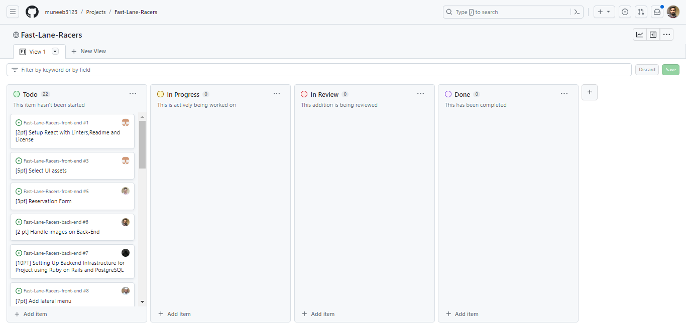

<div align="center">

  <h2><b>Fast-Lane-Racer</b><br><small>A Car Booking Website</small></h2>

</div>

# 📗 Table of Contents

- [📗 Table of Contents](#-table-of-contents)
- [📖 Fast-Lane-Racer ](#-Fast-Lane-Racer-)
  - [🛠 Built With ](#-built-with-)
    - [Tech Stack ](#tech-stack-)
    - [Key Features ](#key-features-)
  - [ React Frontend ](#-react-frontend-)
  - [🚀 Live Demo ](#-live-demo-)
  - [💻 Getting Started ](#-getting-started-)
    - [Prerequisites](#prerequisites)
    - [Setup](#setup)
    - [Install](#install)
    - [Usage](#usage)
    - [Run tests](#run-tests)
    - [Deployment](#deployment)
  - [Authors ](#-authors-)
  - [🔭 Future Features ](#-future-features-)
  - [🤝 Contributing ](#-contributing-)
  - [⭐️ Show your support ](#️-show-your-support-)
  - [🙏 Acknowledgments ](#-acknowledgments-)
  - [❓ FAQ ](#-faq-)
  - [📝 License ](#-license-)

# 📖 Fast-Lane-Racer <a name="about-project"></a>

**Fast-Lane-Racer** is a car booking website that allows users to easily book a ride and travel to their desired destinations. User can reserve a car from the available cars by providing the date and city.
Fast-Lane-Racer provides a seamless and reliable car booking experience.

**Link for the Backend repository:** [URL](https://github.com/muneeb3123/Fast-Lane-Racers-back-end)

## 🛠 Built With <a name="built-with"></a>

### Tech Stack <a name="tech-stack"></a>

<details>
  <summary>Server</summary>
  <ul>
    <li><a href="https://guides.rubyonrails.org/">Ruby on Rails</a></li>
  </ul>
</details>

<details>
  <summary>Client</summary>
  <ul>
    <li>React</li>
  </ul>
</details>

<details>
<summary>Database</summary>
  <ul>
    <li><a href="https://www.postgresql.org/">PostgreSQL</a></li>
  </ul>
</details>

<p align="right">(<a href="#readme-top">back to top</a>)</p>

### Kanban Board <a name="kanban-board"></a>

Initial Kanban board


[Final Kanban Board](https://github.com/users/muneeb3123/projects/4/views/1)

The final number of team members is 5. View the details of team members [here](#-authors-)

<p align="right">(<a href="#readme-top">back to top</a>)</p>

### Key Features <a name="key-features"></a>

- Only Admin can add or delete Cars from the website.
- Users can create accounts and log in securely to access the booking functionalities.
- Choose from a wide range of available cars based on your preferences and requirements.
- Easily book a car for your desired date and time and manage your bookings efficiently.
- The user can cancel the booking.
- Website is responsive and is designed to work nicely for different devices and screens.

<p align="right">(<a href="#readme-top">back to top</a>)</p>

<!-- React Frontend -->

##  React Frontend <a name="react-frontend"></a>

- Backend part of the project [Fast-Lane-Racer-frontend](https://github.com/muneeb3123/Fast-Lane-Racers-front-end)

## 🚀 Live Demo <a name="live-demo"></a>

- [Live Demo](https://shiny-longma-bba6fb.netlify.app)


<p align="right">(<a href="#readme-top">back to top</a>)</p>

## 💻 Getting Started <a name="getting-started"></a>

To get a local copy up and running, follow these steps.

### Prerequisites

To get a local copy up and running follow these simple example steps.

### Prerequisites

In order to run this project you need:

- Code Editor (Vs Code)
- Terminal
- Install Ruby on your computer
- Install rails on your computer
- Node.js
- PostgreSQL

### Setup

Clone these repositories by using the command line to your desired folder:

<u>**For Backend**</u>

```sh
git clone https://github.com/muneeb3123/Fast-Lane-Racers-back-end.git

cd Fast-Lane-Racer-backend
```

<u>**For Frontend**</u>

```sh
git clone https://github.com/muneeb3123/Fast-Lane-Racers-front-end.git

cd Fast-Lane-Racer-frontend
```

### Install

Install this project with:

<u>**For Backend**</u>

```sh
bundle install
```

<u>**For Frontend**</u>

```sh
npm install
```

### Usage

<u>**For Backend**</u>

If you are a Microverse reviewer, create a ```master.key``` file in ```config``` directory and paste the master key provided with the review request. If you are someone other than a Microverse Reviewer, contact us.

To run the project, execute the following commands:

```sh
  rails db:create
  rails db:migrate
  rails db:seed
  rails server
```

<u>**For Frontend**</u>

To run the project, execute the following command:

```sh
  npm start
```

### Run tests

To run tests, run the following command:

```sh
  Backend:  rspec
```

### Deployment

You can deploy this project using:

Render or any other platform.

<p align="right">(<a href="#readme-top">back to top</a>)</p>

### Authors <a name="authors"></a>

👤 **Muneeb-ur-Rehman**

- GitHub: [@muneeb3123](https://github.com/muneeb3123)
- Twitter: [@Hafizabd4](https://twitter.com/Hafizabd4)
- LinkedIn:[Linkedin](https://www.linkedin.com/in/muneeb-rehman-01b6bb193/)

👤 **Ashna Ali**

- GitHub: [@Ashnaali3255](https://github.com/Ashnaali3255)
- Twitter: [@Ashna_Ali1](https://twitter.com/Ashna_Ali1)
- LinkedIn: [LinkedIn](https://www.linkedin.com/in/ashna-ali-342151255/)

👤 **Sameed Mohsin**

- GitHub: [@sameedmohsin28](https://github.com/sameedmohsin28/)
- Twitter: [@sameedmohsin22](https://twitter.com/SameedMohsin22)
- LinkedIn: [Sameed Mohsin](https://www.linkedin.com/in/sameed-mohsin-538792180/)

👤 **Abiola Arobieke**

- GitHub: [@abiola-arobieke](https://github.com/abiola-arobieke)
- Linkedin: [@abiola-arobieke](https://linkedin.com/in/abiola-arobieke)
- Twitter: [@abiola_arobieke](https://twitter.com/abiola_arobieke)

👤 **Larry Villegas**

- GitHub: [@LarryIVC](https://github.com/LarryIVC)
- Twitter: [@LarryVillegas](https://twitter.com/LarryVillegas)
- LinkedIn: [LinkedIn](https://www.linkedin.com/in/larry-villegas-26216b259/)

<p align="right">(<a href="#readme-top">back to top</a>)</p>

## 🔭 Future Features <a name="future-features"></a>

- Add some payment details.
- Add the ability to set time for bookings.

<p align="right">(<a href="#readme-top">back to top</a>)</p>

## 🤝 Contributing <a name="contributing"></a>

Contributions, issues, and feature requests are welcome!

Feel free to check the [issues page](https://github.com/muneeb3123/Fast-Lane-Racers-front-end/issues).

<p align="right">(<a href="#readme-top">back to top</a>)</p>

## ⭐️ Show your support <a name="support"></a>

If you like this project, kindly give me a ⭐️

<p align="right">(<a href="#readme-top">back to top</a>)</p>

## 🙏 Acknowledgments <a name="acknowledgements"></a>

I would like to acknowledge:

- [Microverse](https://www.microverse.org/) for the opportunity to work on this project
- [The creative common](https://www.behance.net/gallery/19759151/Snapscan-iOs-design-and-branding?tracking_source=) for the design
- Design from [Murat Korkmaz on Behance](https://www.behance.net/gallery/26425031/Vespa-Responsive-Redesign)

<p align="right">(<a href="#readme-top">back to top</a>)</p>

## ❓ FAQ <a name="faq"></a>

- **Is Rails still relevant?**

  - [Yes, Rails is still popular among developer](https://blog.railwaymen.org/is-ruby-on-rails-dead)

- **Is it easy to learn Ruby on Rails**

  - [It is very easy to learn compared to most of the programming languages](https://careerkarma.com/blog/why-learn-ruby-on-rails/)

<p align="right">(<a href="#readme-top">back to top</a>)</p>

## 📝 License <a name="license"></a>

This project is [MIT](https://github.com/muneeb3123/Fast-Lane-Racers-front-end/blob/dev/License.md) licensed.

<p align="right">(<a href="#readme-top">back to top</a>)</p>
